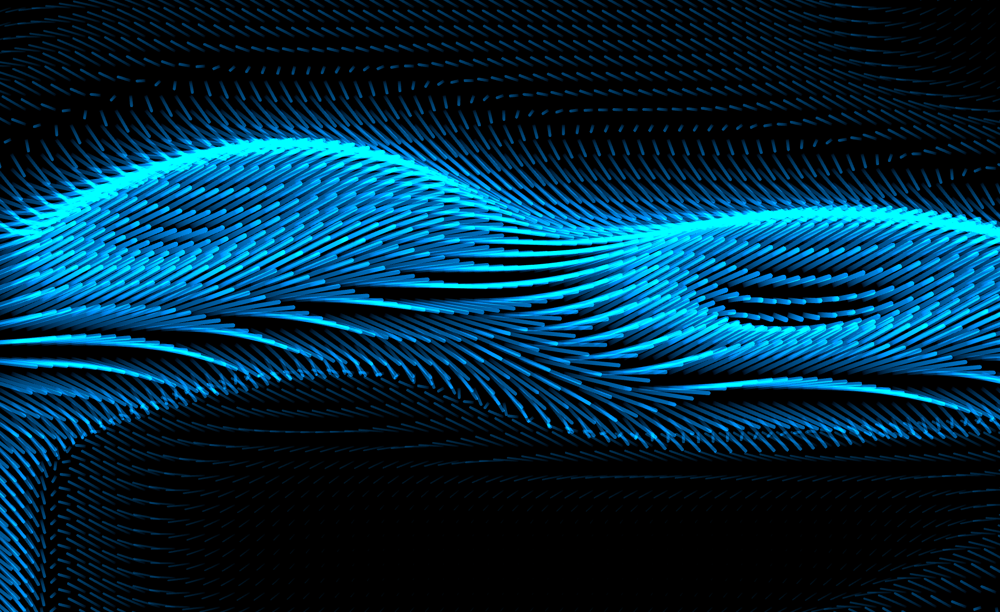
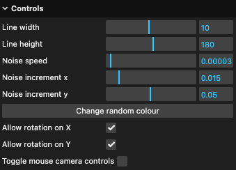

# Omage to Drift MacOS Screensaver

Personal project to recreate the MacOS Drif screensaver using Javascript and Threejs.

Added a control panel to customize the animation parameters. Press the letter `H` to toggle it on and off.

## How it works?

I use [ThreeJS](https://threejs.org/) as the render engine and [Simplex Noise](https://github.com/jwagner/simplex-noise.js) to simulate the fuild animation.

There is a grid of lines that fill the screen based on a resolution value that is equally distributed acorss the width and height of the browser window.

I then draw straight lines pointing towards the camera on the Y axis.

The simplex noise is then calculated for each line on the grid to control their attributes like opaticy, width, height, and rotation angle.

The scene uses and Orthographic camera to achive the correct projection, and additive blending is active on the lines to give them the shinny translucent look.

There is still a lot of work to do. Ideally the line attributes should be handle using vertex and fragment shaders for better renders and move the calculations to the GPU.

PR with improvements are welcome! 👍
